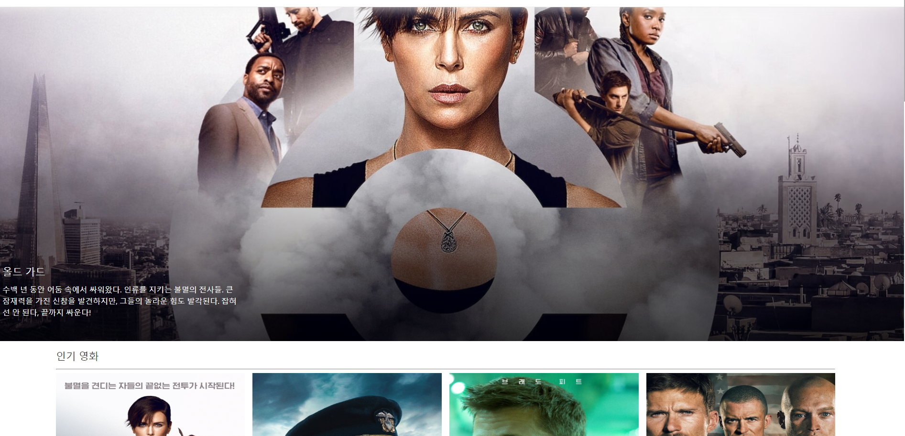
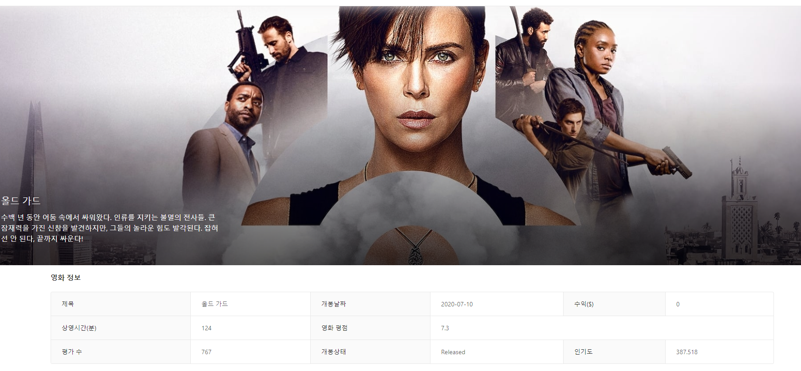

## web 공부

이 사이트는 영화정보와 평점을 보여주는 웹사이트입니다.

john ahn님의 강의를 참고해서 웹을 공부하면서 만들고 있는 중입니다

---------------------------------------------------------------

### 2020/07/16일 배운것들

1. vscode 사용방법
2. mongodb를 사용해서 나의 db 만드는법
3. tmdb에서 영화정보를 api로 가져와서 사용하는 방법

#### 구현한 내용

2020/07/16- 메인 페이지에 영화포스터들을 보여주는 것, 포스터를 클릭하면 그 영화의 상세정보를 볼 수 있게 한 것

